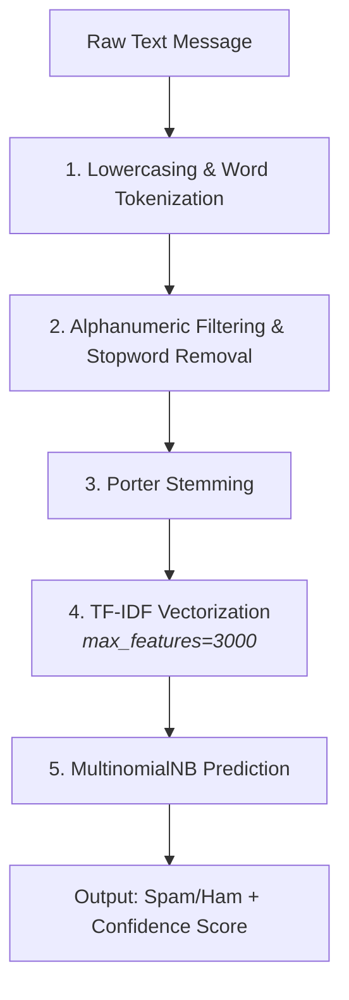

# 📩 SMS Spam Classifier

An end-to-end Natural Language Processing (NLP) web application that classifies incoming SMS messages as **Spam** or **Not Spam (Ham)** in real time.

---

## 🎯 Problem Statement

Spam texts — fake prize alerts, phishing links, scam offers — waste time and put users at security risk. But in spam filtering, **not all errors are equal**: misclassifying a legitimate personal, academic, or transactional message as spam (a *false positive*) can mean a missed deadline or a lost message entirely, which is usually far more costly to a user than seeing one extra spam text.

This project builds a lightweight, high-precision classifier that minimizes false positives while maintaining strong overall detection performance on short, sparse text messages.

---

## 💡 Solution & Technical Approach

1. **Text Preprocessing** — raw SMS messages are normalized via lowercasing, tokenization, alphanumeric filtering, English stopword removal, and Porter Stemming to reduce words to their root stems.
2. **Feature Engineering** — text is vectorized using **TF-IDF**, capped at the top **3,000 features by frequency** to control dimensionality and reduce noise from very rare tokens.
3. **Model Benchmarking** — 11 classification algorithms (probabilistic, linear, tree-based, and ensemble methods) were evaluated on identical TF-IDF features. **Multinomial Naive Bayes** was selected as the production model.
4. **Deployment** — packaged as a Streamlit web app with cached model artifacts, a sample-message simulator, and real-time confidence scores.

---

## 📌 Project Overview

- **Dataset**: [UCI SMS Spam Collection](https://archive.ics.uci.edu/dataset/228/sms+spam+collection) — 5,572 messages 
- **Vectorizer**: TF-IDF, `max_features=3000`
- **Selected model**: Multinomial Naive Bayes
- **Interface**: Streamlit web app with real-time inference and sample message simulation


---

## 🏗️ Architecture & Inference Pipeline



---

## 📊 Model Benchmarking

11 classification algorithms were benchmarked on identical TF-IDF feature matrices:

| Algorithm | Accuracy | Precision |
| --- | --- | --- |
| **Multinomial Naive Bayes** ✅ | **0.9729** | **1.0000** |
| K-Nearest Neighbors | 0.9052 | 1.0000 |
| Support Vector Classifier (Sigmoid) | 0.9758 | 0.9748 |
| Extra Trees | 0.9748 | 0.9746 |
| Random Forest | 0.9691 | 0.9732 |
| XGBoost | 0.9681 | 0.9487 |
| Bagging Classifier | 0.9574 | 0.8655 |
| Logistic Regression (L1) | 0.9565 | 0.9697 |
| Gradient Boosting | 0.9468 | 0.9278 |
| AdaBoost | 0.9236 | 0.8391 |
| Decision Tree | 0.9294 | 0.8283 |

**Why MultinomialNB?** In spam filtering, **Precision is paramount**. A False Positive means an important personal or transactional email gets discarded into the spam folder. Multinomial Naive Bayes achieved a `1.0` precision score with 0 False Positives while maintaining over 97% overall accuracy..


---

## 🖥️ Demo

---


---

## 🧰 Tech Stack

- **Language**: Python 3.x
- **ML / NLP**: scikit-learn, NLTK
- **Data handling**: pandas, NumPy
- **Web app**: Streamlit
- **Model persistence**: pickle

---

## 📁 Repository Structure

```text
sms-spam-classifier/
├── 01_data/
│   ├── spam.csv                 # Raw dataset
│   └── spam_clean.csv           # Cleaned dataset
├── 02_notebooks/
│   ├── eda.ipynb                # Exploratory Data Analysis & Preprocessing
│   └── model.ipynb              # Model building, hyperparameter tuning & benchmarking
├── 03_models/
│   ├── vectorizer.pkl           # Pickled TF-IDF vectorizer (3,000 features)
│   └── model.pkl                # Pickled MultinomialNB model
├── app.py                       # Streamlit web application
├── requirements.txt             # Project dependencies
└── README.md                    # Project documentation
```


