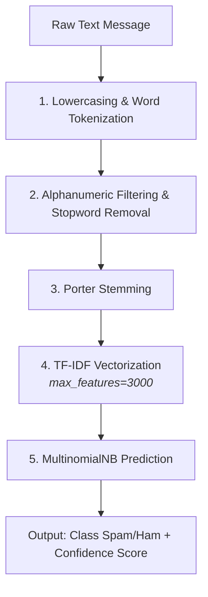

# 📩 SMS & Email Spam Classifier

An end-to-end Natural Language Processing (NLP) web application that classifies SMS and Email messages as **Spam** or **Not Spam(Ham)**. The project evaluates 11 machine learning algorithms, selecting **Multinomial Naive Bayes** for its perfect precision (zero false positives) and high accuracy, deployed interactively via Streamlit.

---

## 📌 Project Overview

- **Dataset**: UCI Machine Learning SMS Spam Collection (5,572 messages).
- **Core Pipeline**: Text Preprocessing $\rightarrow$ TF-IDF Vectorization (capped at 3,000 features) $\rightarrow$ Multinomial Naive Bayes.
- **Production Performance**:
  - **Precision:** `1.0000` (0 False Positives on test split)
  - **Accuracy:** `97.29%`
- **Web App**: Built with Streamlit, featuring real-time inference, example simulators, and confidence score readouts.

---

## 🏗️ Architecture & Data Pipeline



---

## 📊 Model Benchmarking & Evaluation

11 classification algorithms were benchmarked on identical TF-IDF feature matrices:

| Algorithm | Accuracy | Precision |
| --- | --- | --- |
| **Multinomial Naive Bayes** | **0.9729** | **1.0000** |
| K-Nearest Neighbors | 0.9052 | 1.0000 |
| Support Vector Classifier (Sigmoid) | 0.9758 | 0.9748 |
| Random Forest | 0.9691 | 0.9732 |
| Logistic Regression (L1) | 0.9565 | 0.9697 |
| XGBoost | 0.9681 | 0.9487 |
| Gradient Boosting | 0.9468 | 0.9278 |
| Extra Trees | 0.9748 | 0.9746 |
| AdaBoost | 0.9236 | 0.8391 |
| Decision Tree | 0.9294 | 0.8283 |
| Bagging Classifier | 0.9574 | 0.8655 |

> **Why MultinomialNB?** In spam filtering, **Precision is paramount**. A False Positive means an important personal or transactional message gets discarded into the spam folder. Multinomial Naive Bayes achieved a `1.0` precision score with 0 False Positives while maintaining over 97% overall accuracy.

---

## 📁 Repository Structure

```text
sms-spam-classifier/
├── 01_data/
│   └── spam.csv                # raw dataset
│   └── spam_clean.csv          # Cleaned dataset
├── 02_notebooks/
│   └── eda.ipynb               # EDA, preprocessing 
│   └── model.ipynb             # model building and benchmarking
├── 03_models/
│   ├── vectorizer.pkl          # Pickled TF-IDF vectorizer (3,000 features)
│   └── model.pkl               # Pickled MultinomialNB model
├── app.py                      # Streamlit web application
├── requirements.txt            # Project dependencies
└── README.md                   # Project documentation

```

