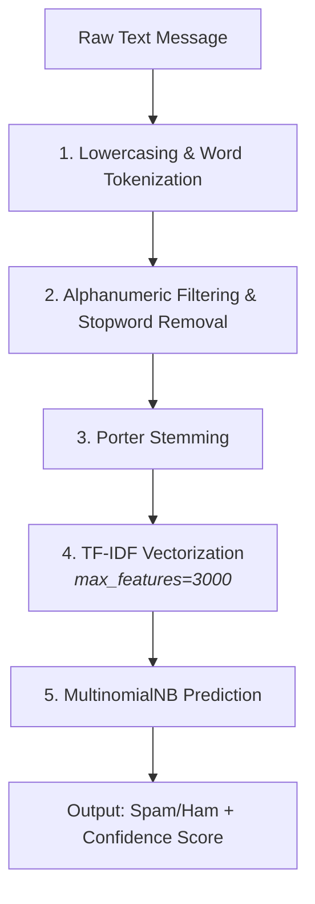

# 📩 SMS Spam Classifier

An end-to-end Natural Language Processing (NLP) web application that classifies incoming SMS messages as **Spam** or **Not Spam (Ham)** in real time.

[](https://sms-spam-classifier-manish.streamlit.app/)
[](https://www.python.org/)


---
📋 Table of Contents
- [🎯 Problem Statement](#-problem-statement)
- [💡 Solution & Technical Approach](#-solution--technical-approach)
- [📌 Project Overview](#-project-overview)
- [🏗️ Architecture & Inference Pipeline](#️-architecture--inference-pipeline)
- [📊 Model Benchmarking](#-model-benchmarking)
- [🖥️ Live Demo](#️-live-demo)
- [📁 Repository Structure](#-repository-structure)
- [🚀 Local Installation & Setup](#-local-installation--setup)
- [🧰 Tech Stack](#-tech-stack)

---

## 🎯 Problem Statement

Spam messages—like fake prize alerts, lottery scams, and phishing links—waste time and put our online security at risk. However, in automated filtering, **not all errors carry equal consequences**:

* **False Negative (Spam in Inbox):** A minor inconvenience that the user can manually delete.
* **False Positive (Not SMS in Junk):** A critical failure. Dropping an urgent personal SMS, two-factor OTP, or academic notification can lead to missed deadlines and loss of critical communication.

**Objective:** Build a lightweight, real-time NLP classifier optimized for **Zero False Positives (100% Precision)** while preserving high overall detection accuracy on sparse text inputs.

---

## 💡 Solution & Technical Approach

1. **Text Preprocessing:** Raw SMS messages are normalized through lowercasing, word tokenization, alphanumeric filtering, stopword removal, and Porter Stemming to extract core word roots.
2. **Feature Extraction:** Preprocessed text is transformed using **TF-IDF Vectorization** (`max_features=3000`) to capture term importance while suppressing noise from rare typos.
3. **Model Selection:** Evaluated 11 classification algorithms across probabilistic, linear, tree-based, and ensemble paradigms. **Multinomial Naive Bayes (MNB)** was chosen for its perfect precision on test data.
4. **Interactive Deployment:** Packaged into a Streamlit web app featuring artifact caching (`@st.cache_resource`), sample message simulation buttons, and dynamic confidence readouts.

---

## 📌 Project Overview

* **Dataset:** [UCI SMS Spam Collection](https://archive.ics.uci.edu/dataset/228/sms+spam+collection) (5,574 raw messages; cleaned and deduplicated)
* **Feature Representation:** TF-IDF (`max_features=3000`)
* **Optimal Model:** Multinomial Naive Bayes (`alpha=1.0`)
* **Key Metric:** `Precision = 1.0000` (0 False Positives on test split) | `Accuracy = 97.29%`
* **Interface:** Streamlit Community Cloud


---

## 🏗️ Architecture & Inference Pipeline



---

## 📊 Model Benchmarking

11 classification algorithms were benchmarked on identical TF-IDF feature matrices:

| Algorithm | Accuracy | Precision |
| --- | --- | --- |
| **Multinomial Naive Bayes** ✅ | **0.9729** | **1.0000** |
| K-Nearest Neighbors | 0.9052 | 1.0000 |
| Support Vector Classifier (Sigmoid) | 0.9758 | 0.9748 |
| Extra Trees | 0.9748 | 0.9746 |
| Random Forest | 0.9691 | 0.9732 |
| XGBoost | 0.9681 | 0.9487 |
| Bagging Classifier | 0.9574 | 0.8655 |
| Logistic Regression (L1) | 0.9565 | 0.9697 |
| Gradient Boosting | 0.9468 | 0.9278 |
| AdaBoost | 0.9236 | 0.8391 |
| Decision Tree | 0.9294 | 0.8283 |

**Why MultinomialNB?** In spam filtering, **Precision is paramount**. A False Positive means an important personal or transactional email gets discarded into the spam folder. Multinomial Naive Bayes achieved a `1.0` precision score with 0 False Positives while maintaining over 97% overall accuracy..


---
## 🖥️ Live Demo

🔗 App URL: https://sms-spam-classifier-manish.streamlit.app/


---


## 🧰 Tech Stack

- **Language**: Python 3.10+
- **ML / NLP**: scikit-learn, NLTK
- **Data handling**:Numpy,Pandas
- **App Framework**: Streamlit
- **Model Serialization**: pickle

---

## 📁 Repository Structure

```text
sms-spam-classifier/
├── 01_data/
│   ├── spam.csv                 # Raw dataset
│   └── spam_clean.csv           # Cleaned dataset
├── 02_notebooks/
│   ├── eda.ipynb                # Exploratory Data Analysis & Preprocessing
│   └── model.ipynb              # Model building, hyperparameter tuning & benchmarking
├── 03_models/
│   ├── vectorizer.pkl           # Pickled TF-IDF vectorizer (3,000 features)
│   └── model.pkl                # Pickled MultinomialNB model
├── app.py                       # Streamlit web application
├── requirements.txt             # Project dependencies
└── README.md                    # Project documentation
```


